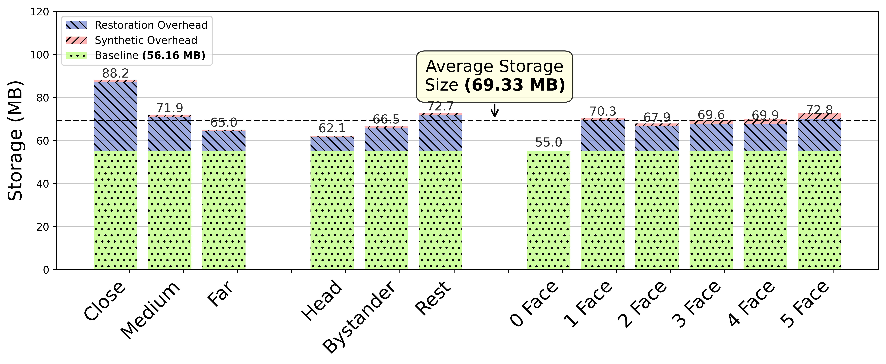
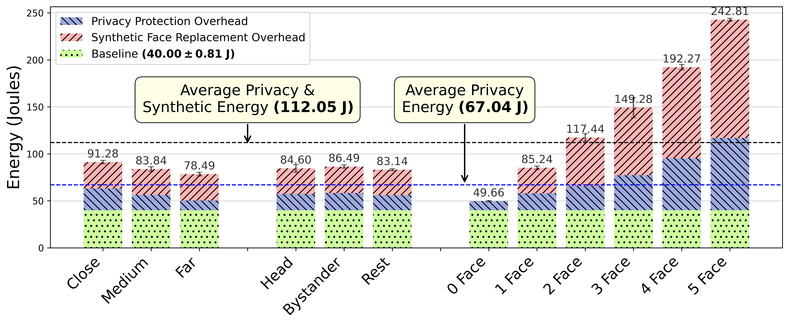
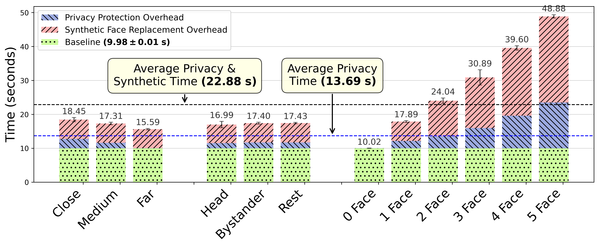

# Consent-Driven Privacy for Smart Glasses

This repository contains the reference implementation of Consent-Driven Privacy for Smart Glasses, a privacy-by-default, three-tier system that protects bystanders while preserving utility for consenting parties. The working prototype enforces on-device blurring at capture, stores only encrypted face packets and embeddings so raw facial pixels are never exposed, and supports landmark-driven synthetic face replacements on a companion phone. When a bystander explicitly consents, the system uses a cryptographic, consent-mediated split-key protocol with a trusted third party (TTP) to restore the original face, ensuring restoration is possible only with the required approval. The prototype runs in real time on Raspberry Pi–class hardware and the accompanying paper evaluates the privacy/utility trade-offs.

---

## Highlights / contributions
- **Privacy at capture** — mandatory on-device blurring and per-face encrypted face packets.
- **Reversible & consented restoration** — a TTP-mediated split-key protocol ensures restorations only occur with bystander signatures.
- **Usability-preserving synthetic replacement** — landmark-driven, mobile-optimized face replacement for wearer experience.
- **Working prototype** — implemented on Raspberry Pi 4 + companion Android app.
- **Dataset** — 16,500 annotated frames collected with Ray-Ban Meta hardware (released with this repo).


---

## Architecture 
The repository contains code and assets mapped to the paper’s three tiers:


- `tier1/` — on-device pipeline (face detection, landmarks, convex-hull blurring, per-stream AES keys, encryption of face packets and embeddings).
- `tier2/` — companion-phone synthetic replacement pipeline and Android demo app (warping + MobileFaceSwap refinement).
- `tier3/` — prototype TTP mediator (server-side matching of encrypted embeddings to registered bystanders and consent-management simulation).
- `dataset/` — sample frames, annotations, and instructions to recreate experiments.
- `scripts/` — utilities to run experiments, convert formats, and reproduce the evaluation.


## Evaluation (images + tables)

<p align="center">
  
  
  
</p>

The figures above summarize storage, energy, and latency for SITARA across 12 categories
(Close, Medium, Far, Head, Bystander, Rest, and 0–5 Face). The tables below list the exact values.

### Summary vs. Baseline

**Storage**
| Metric | Baseline | Average (all categories) | Overhead vs baseline |
|:---|---:|---:|---:|
| Storage (MB) | 56.16 | 69.33 | 23.5% |

**Energy**
| Metric | Baseline | Avg privacy-only | Avg privacy+synthetic | Overhead (privacy) | Overhead (full) |
|:---|---:|---:|---:|---:|---:|
| Energy (J) | 40.00 (±0.81) | 67.04 | 112.05 | 1.68× | 2.80× |

**Latency**
| Metric | Baseline | Avg privacy-only | Avg privacy+synthetic | Overhead (privacy) | Overhead (full) |
|:---|---:|---:|---:|---:|---:|
| Latency (s) | 9.98 (±0.01) | 13.69 | 22.88 | 1.37× | 2.29× |

> Interpretation: relative to the baseline pipeline, SITARA’s full (privacy + synthetic) mode increases
> average **energy** by ~2.8× and **time** by ~2.29×; **storage** rises ~23.5% on average.

---

### Per-scene type (Close / Medium / Far / Head / Bystander / Rest)

| Scene type | Storage (MB) | Storage ↑% vs 56.16 MB | Energy (J) | Energy ↑% vs 40 J | Latency (s) | Latency ↑% vs 9.98 s |
|:---|---:|---:|---:|---:|---:|---:|
| Close | 88.20 | 57.1% | 91.28 | 128.2% | 18.45 | 84.9% |
| Medium | 71.90 | 28.0% | 83.84 | 109.6% | 17.31 | 73.4% |
| Far | 65.00 | 15.7% | 78.49 | 96.2% | 15.59 | 56.2% |
| Head | 62.10 | 10.6% | 84.60 | 111.5% | 16.99 | 70.2% |
| Bystander | 66.50 | 18.4% | 86.49 | 116.2% | 17.40 | 74.3% |
| Rest | 72.70 | 29.5% | 83.14 | 107.8% | 17.43 | 74.6% |

---

### By number of faces in frame (0–5)

| Category | Storage (MB) | Storage ↑% vs 56.16 MB | Energy (J) | Energy ↑% vs 40 J | Latency (s) | Latency ↑% vs 9.98 s |
|:---|---:|---:|---:|---:|---:|---:|
| 0 Face | 55.00 | −2.1% | 49.66 | 24.1% | 10.02 | 0.4% |
| 1 Face | 70.30 | 25.2% | 85.24 | 113.1% | 17.89 | 79.3% |
| 2 Face | 67.90 | 20.9% | 117.44 | 193.6% | 24.04 | 140.9% |
| 3 Face | 69.60 | 23.9% | 149.28 | 273.2% | 30.89 | 209.5% |
| 4 Face | 69.90 | 24.5% | 192.27 | 380.7% | 39.60 | 296.8% |
| 5 Face | 72.80 | 29.6% | 242.81 | 507.0% | 48.88 | 389.8% |

**Observations**
- Energy & latency scale sharply with more faces (5-Face is the worst case: 242.81 J, 48.88 s).
- “0 Face” is very close to baseline time (10.02 s) and only modestly above baseline energy (49.66 J).
- Storage varies less with faces (roughly +20–30% vs baseline), peaking at 72.80 MB in 5-Face.
- Among scene types, **Close** has the highest storage (88.20 MB).


---
## Setup

1. **Clone the repository** (if you haven't already):

    ```bash
    git clone <repository-url>
    cd SmartGlassesPrivacy
    ```

2. **Install dependencies** using the provided `requirements.txt` file:

    ```bash
    pip install -r requirements.txt
    ```

3. **Set up input and output folders and store input video in the input folder**:

    ```bash
    mkdir input
    mkdir output
    ```

---

## Changing Input and Output Video Paths

To specify which video to blur and where to save the output, edit the `Config` class in `main.py`. Locate the following lines:

```python
class Config:
    input_video_path = "./input/video.mp4"
    output_video_path = "./output/video.mp4"
    # ...other config options...
```

- Set `input_video_path` to the path of your input video file.
- Set `output_video_path` to the desired path for the blurred output video.

Set other hyperparameters like `OVERLAY_DETECTOR_BOX`, `DISPLAY_VIDEO`, and `SAVE_OUTPUT` as needed.  
Save your changes and run `main.py`.  
You may also use `encrypt.py` in the encryption folder.

---

## Usage

```bash
python main.py
```

This will generate the relevant encrypted metadata, face embedding, and landmark files along with the blurred video in the output directory.

---

### Both these files are an abstraction to allow for easy prototyping and demo. For actual testing, the performance_eval_rpi.py file in the encryption folder was used. The only differences are the use of picamera interface instead of the openCV interface (to support the camera module) and the use of the actual three queue model described in the paper instead of a demo sequential approach in main.py.


## Restoration

To demo the restoration mechanism, navigate to the decryption folder:

```bash
cd decryption
```

Then execute the `ttp_code_cosine.py` file. This file requires that you specify a `DB_PATH` consisting of face images in the output folder, simulating the TTP Database of faces.

```bash
python ttp_code_cosine.py
```

This file will decrypt the relevant keys and then decrypt the embeddings generated initially. It will then match the embeddings with the faces in the database and generate a `final_matching_results.json` file that stores (in reality it would send to the wearer securely) the unencrypted keys in the output folder.

Then execute the `restore.py` file to generate the restored video:

```bash
python restore.py
```

The restored video will be generated in the output folder.

You can also execute the utility file `decrypt_face_blobs_per_id.py`, which will use the encrypted metadata and the TTP private key to decrypt and store the face regions as JPEGs for reference.

---

## Synthetic Replacement

Warp a video with a synthetic face using `warping.py`, then optionally run **MobileFaceSwap** on the warped result, all from one CLI.

### Prerequisites

- Navigate to the Synthetic Replacement folder.
- Place **MobileFaceSwap** next to `main.py`:
    - `MobileFaceSwap/video_test.py`
    - `MobileFaceSwap/checkpoints/arcface.pdparams` (and any other weights that repo requires)
- Place assets next to `main.py`:
    - `synthetic_faces/` (face images, e.g., `female1.jpg`)
    - `synthetic_landmarks/` (matching `.txt` files with the same stem, e.g., `female1.txt`)
    - `video_colors.json` mapping video basename → RGB  
      Example:
      ```json
      { "blurred": "(29,25,24)" }
      ```

### Expected Landmarks Layout (for the input video)

```
<landmarks_root>/
  <video_basename>/
    face_0/
      frame_0000.txt
      frame_0001.txt
    face_1/
    ...
```

### Run (Single Video)

```bash
python main.py \
  --video "/absolute/path/to/your_video.mp4" \
  --landmarks_root "/absolute/path/to/video_landmarks" \
  --after_swap
```

> You do **not** need to pass `--synth_img_folder`, `--synth_lm_folder`, `--output_root`, or `--mfs_script`; the script uses local folders next to `main.py`.

### Outputs

- `<repo_dir>/<video_name>.mp4` — warped video
- `<repo_dir>/best_match/` — chosen synthetic (image + landmarks + manifest)
- MobileFaceSwap’s swapped result will also be written under `<repo_dir>` (naming per that script).

---

For further customization or troubleshooting, refer to comments within each script.

---

## Dataset Contents


We release a sampled subset (16,500 annotated frames) captured with Ray-Ban Meta-style glasses. The dataset includes:


- **video_frames_mapping.csv**  
  Mapping of each video name to the extracted frame numbers.

- **Annotated XMLs/**  
  Manually annotated XML files.  
  Naming convention: `{VideoName}_Frame{FrameNumber}_output.xml`

- **Annotated JSONs/**  
  Manually annotated JSON files.  
  Naming convention: `{VideoName}_Frame{FrameNumber}_output.json`

- **Movement of Faces/**  
  Videos categorized by face movement.

- **Num of Faces/**  
  Videos categorized by number of faces.

- **Size of Faces/**  
  Videos categorized by face size across datasets and videos.

  [Dataset Link](https://drive.google.com/drive/folders/1ApYf8pxH0Om5gLb2uIyenvLACjYiDzZN?usp=sharing)


## Evaluation
### All latency and energy evaluations were done manually for live videos recorded by a plugged pi camera module using the performance_eval_rpi.py file in the encryption folder. It also requires mounting a USB drive in the /mnt/usb folder as described in the paper.

### 📊 Accuracy Evaluation

#### **SITARA_eval.ipynb — Full Accuracy Evaluation Pipeline**

The `SITARA_eval.ipynb` notebook provides a **complete accuracy evaluation framework** for SITARA, enabling in-depth analysis of detection, embedding, and restoration performance. It is designed to reproduce and extend the accuracy results reported in the paper with fully configurable evaluation parameters.

---

### 🧪 Features of `SITARA_eval.ipynb`

| Feature | Description |
|--------|-------------|
| 🔄 **COCO-style Metrics** | Computes standard COCO detection metrics (AP/AR) across multiple IoU thresholds. |
| 📈 **Confidence Threshold Tuning** | Allows you to adjust detection confidence thresholds dynamically to study precision-recall trade-offs. |
| ⏩ **Frame Skip Evaluation** | Evaluates performance under different frame skip values to analyze latency-accuracy trade-offs. |
| 📊 **Per-Video & Aggregate Results** | Generates metrics for each individual video and summarizes results across the dataset. |
| 📁 **GT vs Prediction Comparison** | Compares your model’s outputs with ground truth annotations to quantify detection and localization accuracy. |
| 🔍 **Visual Debugging** | Provides visualization cells to inspect false positives, false negatives, and mislocalized detections by saving frames. |
| 📁 **COCO Format Integration** | Supports reading ground truth and prediction data in COCO-compatible JSON format (as generated by your pipeline). |

---

### 🛠️ How to Use

1. **Prepare Ground Truth & Prediction Data**  
   - Ensure ground truth annotation JSONs are available under the `Annotated JSONs/` directory.  
   - Make sure prediction JSON files (from the blurring pipeline) are stored in `output/frame_json/`.

2. **Open the Notebook**

   ```bash

   jupyter notebook SITARA_eval.ipynb


