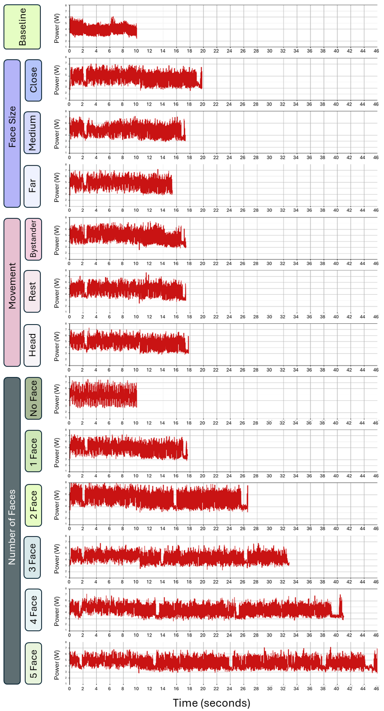
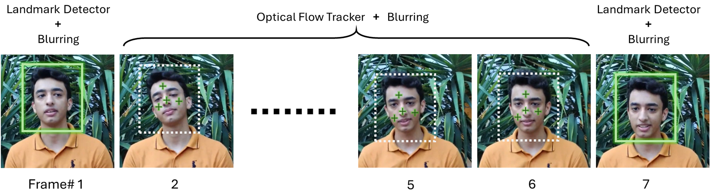
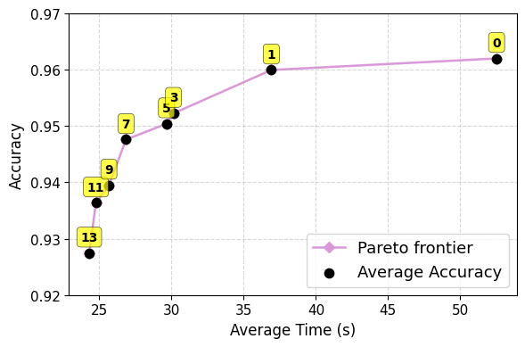
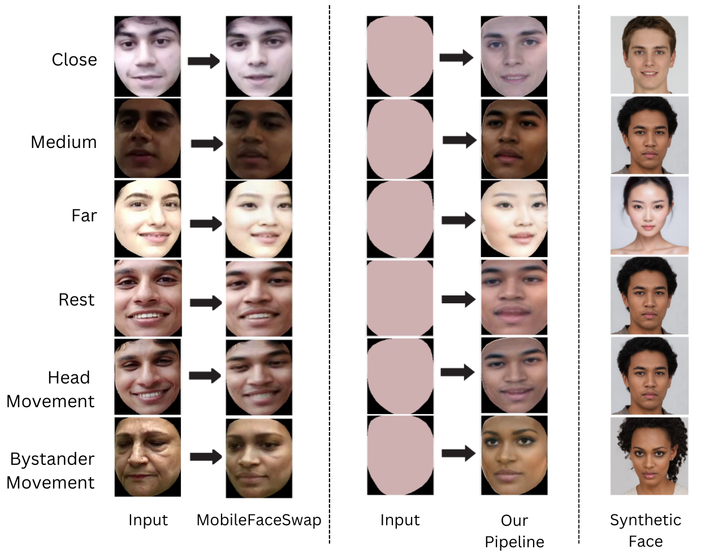

# 🕶️ Consent-Driven Privacy for Smart Glasses

This repository contains the reference implementation of **Consent-Driven Privacy for Smart Glasses**, a privacy-by-default, three-tier system designed to protect bystanders while preserving utility for consenting parties.

The system enforces **on-device blurring at capture**, storing only encrypted face packets and embeddings so raw facial pixels are never exposed. It supports landmark-driven **synthetic face replacements** on a companion phone for immediate wearer utility. When a bystander explicitly consents, the system uses a cryptographic, consent-mediated split-key protocol with a Trusted Third Party (TTP) to restore the original face.

The prototype runs in real-time on **Raspberry Pi 4** hardware, and this repository includes the full pipeline, evaluation scripts, and a novel dataset.

---

## 🌟 Highlights & Contributions

* **🔒 Privacy at Capture:** Mandatory on-device blurring with per-face encrypted packets.
* **🔑 Reversible & Consented Restoration:** A TTP-mediated split-key protocol ensures restorations only occur with bystander signatures.
* **🎭 Usability-Preserving Synthetic Replacement:** Landmark-driven, mobile-optimized face replacement to maintain wearer experience without compromising privacy.
* **⚙️ Working Prototype:** Full implementation on Raspberry Pi 4 + companion Android app.
* **📂 Dataset:** 16,500 annotated frames collected with Ray-Ban Meta hardware (released with this repo).

---

## 🏗️ Architecture

The repository code and assets are mapped to the paper’s three-tier architecture:


| Component | Description |
| :--- | :--- |
| **`main.py`** | **On-Device Pipeline:** Handles face detection, landmark extraction, convex-hull blurring, per-stream AES key generation, and encryption of face packets/embeddings. |
| **`Synthetic Replacement/`** | **Companion Pipeline:** Warping and MobileFaceSwap refinement for synthetic face generation. |
| **`decryption/`** | **Restoration & TTP:** Includes `ttp_code_cosine.py` (server-side matching of encrypted embeddings) and `restore.py` (companion phone restoration). |
| **`SITARA_eval.ipynb`** | **Evaluation:** Full accuracy evaluation framework. |

---

## 📂 Dataset Contents


We release a sampled subset (**16,500 annotated frames**) captured with Ray-Ban Meta-style glasses.
**[🔗 Download Dataset Here](https://drive.google.com/drive/folders/1ApYf8pxH0Om5gLb2uIyenvLACjYiDzZN?usp=sharing)**

The dataset includes:

* **`video_frames_mapping.csv`**: Mapping of video filenames to extracted frame numbers.
* **`Annotated XMLs/`**: Manually annotated XML files (`{VideoName}_Frame{FrameNumber}_output.xml`).
* **`Annotated JSONs/`**: Manually annotated JSON files compatible with COCO metrics.
* **Categorized Folders**:
    * **`Movement of Faces/`**: Videos categorized by subject movement.
    * **`Num of Faces/`**: Videos categorized by density (0–5 faces).
    * **`Size of Faces/`**: Videos categorized by face size (Close, Medium, Far).

---

## ⚙️ Setup & Installation
The repository has been thoroughly tested on Windows 11 Pro with Python 3.12.1 and 3.12.3. Please ensure your system has installed both the gcc and g++ compilers. You can check this by executing the following commands.

```bash
gcc --version
g++ --version
```

### 1. Clone & Install
```bash
git clone <repository-url>
cd SmartGlassesPrivacy
pip install -r requirements.txt
```

### 2. Directory Setup
Create the necessary input/output directories and place your source video in `input/`:

```bash
mkdir input
mkdir output
# Place your video.mp4 inside input/
```

### 3. Configuration
Edit the `Config` class in `main.py` to point to your specific video and adjust parameters:

```python
class Config:
    input_video_path = "./input/video.mp4"
    output_video_path = "./output/video.mp4"
    OVERLAY_DETECTOR_BOX = False # Set True for debugging
    SAVE_OUTPUT = True
    # ...other config options...
```

---

## 🚀 Usage

### 1. On-Device Capture (Blurring & Encryption)
Run the main pipeline to generate the blurred video, encrypted metadata, face embeddings, and landmark files:

```bash
python main.py
```

**Troubleshooting VideoWriter:** If the blurred video doesn't save, modify the codec in `src/utils:136`:
```python
fourcc = cv2.VideoWriter_fourcc(*'avc1')
```

Try alternatives like `*'mp4v'`, `*'XVID'`, or `*'MJPG'`. Note: XVID/MJPG require `.avi` extension.


**Note:** `main.py` uses a sequential demo approach for easy prototyping. For the actual concurrency testing described in the paper (using the 3-queue model), please refer to `encryption/performance_eval_rpi.py`.

### 2. Restoration (Decryption)
To demo the consent-based restoration, navigate to the decryption folder.

#### Step A: Simulate TTP Matching
This script decrypts embeddings, matches them against a local "database" (images in the output folder), and generates keys for valid matches:

```bash
cd decryption
python ttp_code_cosine.py
```

#### Step B: Restore Video
Using the keys released by the TTP, restore the original faces:

```bash
python restore.py
```

**Optional utility:** Run `decrypt_face_blobs_per_id.py` to inspect decrypted face regions as standalone JPEGs.

### 3. Synthetic Replacement
Warp a video with a synthetic face and refine it using MobileFaceSwap.

**Prerequisites:**
- Ensure the MobileFaceSwap checkpoints are correctly placed inside the `Synthetic Replacement/MobileFaceSwap/` directory.
   The checkpoints can be downloaded from the official **MobileFaceSwap** repository through their provided drive link: https://github.com/Seanseattle/MobileFaceSwap

**Run Command:**
```bash
cd "Synthetic Replacement"
python main.py \
  --video "/absolute/path/to/your_video.mp4" \
  --landmarks_root "/absolute/path/to/video_landmarks" \
  --after_swap
```

**Output:** The script generates the warped video and the final swapped result in the repo directory.

---

## 📊 Evaluation & Results

### 🧪 Accuracy Evaluation (SITARA_eval.ipynb)
We provide a Jupyter Notebook to reproduce our COCO-style metrics (AP/AR):

- Ensure Ground Truth JSONs are in `Annotated JSONs/`
- Ensure Prediction JSONs are in `output/frame_json/`
- Run: `jupyter notebook SITARA_eval.ipynb`

### Privacy Protection (Tier 1 Blurring)

#### Detailed Breakdown (AP/AR)
Values in **bold** indicate the best performance in the comparison.

| Category | Sub-Category | Our Pipeline (AP) | Our Pipeline (AR) | EgoBlur (AP) | EgoBlur (AR) |
|----------|--------------|-------------------|-------------------|--------------|--------------|
| **Number of Faces** | One Face | **0.990** | 0.997 | 0.932 | **1.000** |
| | Two Face | **0.967** | 0.979 | 0.963 | **0.982** |
| | Three Face | **0.979** | **0.982** | 0.974 | 0.981 |
| | Four Face | 0.900 | 0.904 | **0.909** | **0.934** |
| | Five Face | 0.882 | 0.917 | **0.952** | **0.969** |
| **Movement State** | Rest | **0.990** | 0.998 | 0.971 | **0.999** |
| | Head | 0.920 | 0.947 | **0.925** | **0.980** |
| | Bystander | 0.959 | 0.968 | **0.961** | **0.983** |
| **Face Size** | Far | **1.000** | **1.000** | 0.930 | **1.000** |
| | Medium | **0.990** | 0.992 | 0.856 | **0.993** |
| | Close | **0.990** | 0.997 | 0.989 | **1.000** |

#### Summary: Ours vs. Baseline

| Method | CCV2 (AP) | CCV2 (AR) | Custom Dataset (AP) | Custom Dataset (AR) |
|--------|-----------|-----------|---------------------|---------------------|
| Our Pipeline | 0.98 | **0.99** | **0.9421** | 0.9531 |
| EgoBlur | **0.99** | **0.99** | 0.9354 | **0.9736** |

#### The following figure highlights the stability of Tier 1 Blurring Accuracy across detector confidence thresholds


### Synthetic Face Replacement

The evaluation.py file inside the Synthetic Replacement folder compares our pipeline with the baseline (MFS) across 5 different metrics. Modify the folder path containing original videos, MFS videos, and videos using our pipeline.

#### Category Breakdown
The figure below shows a category wise breakdown of synthetic face replacement metrics.


The following table shows a summarized version of results.

| Metric | Baseline | Our Pipeline (Sitara) | Theoretical Range |
|--------|----------|----------------------|-------------------|
| FID ↓ | 31.00 ± 13.83 | 63.70 ± 27.78 | ≥ 0 |
| SSIM ↑ | 0.76 ± 0.07 | 0.61 ± 0.07 | [0, 1] |
| PSNR (dB) ↑ | 15.87 ± 2.77 | 12.85 ± 1.95 | [0, ∞) |
| LPIPS ↓ | 0.14 ± 0.06 | 0.27 ± 0.07 | [0, 1] |
| Landmark Dist. ↓ | 8.81 ± 3.99 | 15.94 ± 7.13 | [0, ∞) |

### System Cost (Storage, Energy, Latency)
System latency and energy overheads are reported on live videos recorded using RPI Camera Module 1.3. The measurement workbench is shown here:


#### Summary vs. Baseline

| Metric  | Baseline | Average (Privacy Only) | Average (Privacy + Synthetic) |
|---------|----------|------------------------|-------------------------------|
| Storage | 56.16 MB | — | 69.33 MB |
| Energy  | 40.00 J  | 67.04 J | 112.05 J                      |
| Latency | 9.98 s   | 13.69 s | 22.88 s|

#### System Cost breakdown per category


#### Detailed Breakdown by Scene Type

| Scene type | Storage (MB) | Energy (J) | Latency (s) |
|------------|--------------|------------|-------------|
| Close | 88.20 | 91.28 | 18.45 |
| Medium | 71.90 | 83.84 | 17.31 |
| Far | 65.00 | 78.49 | 15.59 |
| Head | 62.10 | 84.60 | 16.99 |
| Bystander | 66.50 | 86.49 | 17.40 |
| Rest | 72.70 | 83.14 | 17.43 |

#### Detailed Breakdown by Number of Faces

| Category | Storage (MB) | Energy (J) | Latency (s) |
|----------|--------------|------------|-------------|
| 0 Face | 55.00 | 49.66 | 10.02 |
| 1 Face | 70.30 | 85.24 | 17.89 |
| 2 Face | 67.90 | 117.44 | 24.04 |
| 3 Face | 69.60 | 149.28 | 30.89 |
| 4 Face | 69.90 | 192.27 | 39.60 |
| 5 Face | 72.80 | 242.81 | 48.88 |

#### Power Consumption Traces by Category

The figure below shows Power Consumption traces for each category on RPi 4 B:

<p align="center">

</p>

---

## 🔬 System Performance Deep Dive

### Tier 1: On-Device Face Blurring and Encryption

On-device face blurring and encryption processes each frame through: **Face Detector → Landmark Detector → Blurring + Encryption**. The largest computational cost is running full-frame face detection.

#### Detector Inference Cost

The figure below highlights the detector inference cost in terms of Power (W) and Time (ms) on RPi 4 Model B:

<p align="center">

</p>

#### Frame Skip Strategy & Optical Flow Tracking

To reduce this computational bottleneck, we utilize a **frame skip strategy** with optical flow tracking between frames. The figures below show the Accuracy-Latency tradeoff across skip values:

<p align="center">

</p>
<p align="center">


### Tier 2: Synthetic Face Replacement

Synthetic Replacement applies landmark-driven replacement on **blurred** inputs. We compare our pipeline with a baseline where synthetic replacements are applied on **unblurred** faces as a target upper-bound.

#### Visual Quality Comparison

The figure below visually demonstrates Tier 2 synthetic replacement accuracy for our pipeline compared with baselines:

<p align="center">

</p>

### Tier 3: Consent-Based Restoration

We implement the consent-based restoration flow through a simulated server architecture:

#### Restoration Pipeline Flow

1. **`main.py`** - Executes the code for the camera glasses, generating blurred video and encrypted data.

2. **`decryption/transmit_data_to_phone.py`** - Transmits encrypted data to the phone and subsequently encrypted keys and embeddings to the TTP (placed in decryption folder).

3. **`decryption/ttp_code_cosine.py`** - Performs the matching on the TTP server.

4. **`decryption/transmit_keys_to_phone.py`** - Transmits the decrypted keys back to the companion phone (assuming consent is granted).

5. **Companion Phone Application** - Listens for this data and uses the key(s) to decrypt the data and restore the decrypted regions back into the blurred video.

#### Running the Restoration Flow

**Prerequisites:**
- The companion Android application should be running for both transmit files.
- Ensure all encrypted data is generated from `main.py` before starting the restoration process.

**Execution Order:**
```bash
# Step 1: Generate encrypted data
python main.py

# Step 2: Transmit to phone and TTP
cd decryption
python transmit_data_to_phone.py

# Step 3: TTP performs matching
python ttp_code_cosine.py

# Step 4: Transmit keys back to phone
python transmit_keys_to_phone.py
```

#### Companion Android Application

The Android application implementation can be found at this drive link: https://drive.google.com/drive/u/4/folders/1MIjSEbBOurB1UHyRVYXc_2DuNivU9QtL

---


